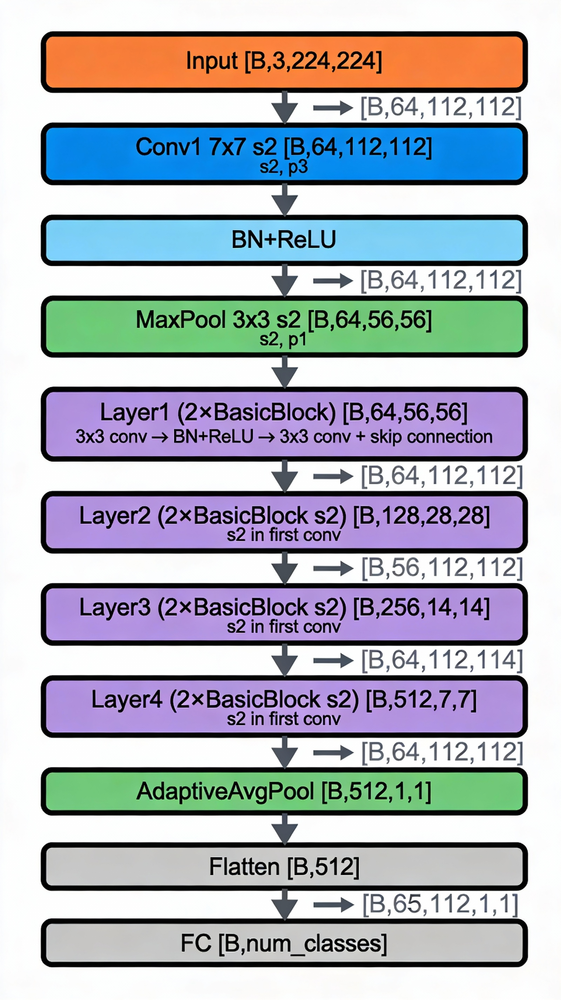

This module is a **PyTorch implementation of the ResNet-18 architecture**, manually written rather than imported from `torchvision.models`. Let’s go **line by line and concept by concept**, explaining every important detail.

***

### 1. 3×3 Convolution Helper

```python
def conv3x3(in_planes, out_planes, stride=1):
    """3x3 convolution with padding"""
    return nn.Conv2d(in_planes, out_planes, kernel_size=3, stride=stride,
                     padding=1, bias=False)
```

- **Purpose:** Creates a standard 3×3 convolution layer.
- **Parameters:**
  - `in_planes`: number of input channels.
  - `out_planes`: number of output channels (filters).
  - `stride`: step size (default 1).
- **Padding = 1** keeps spatial dimensions after convolution the same (`same` padding for 3×3).
- **bias=False** because a **BatchNorm2d** layer follows, which has its own bias.

This helper keeps code tidy instead of retyping the same layer definition.

***

### 2. Basic Residual Block (ResNet’s Building Block)

```python
class BasicBlock(nn.Module):
    expansion = 1
```

- Defines the **smallest ResNet block**, used in ResNet-18 and ResNet-34.
- `expansion = 1` — the number of output channels isn’t expanded (unlike Bottleneck blocks in deeper ResNets, where `expansion=4`).

***

#### Constructor

```python
def __init__(self, inplanes, planes, stride=1, downsample=None):
```
- `inplanes`: input channel size.
- `planes`: output channel size.
- `stride`: controls downsampling in the first convolution of the block.
- `downsample`: optional transformation for the residual (shortcut) path.

Inside:
```python
self.conv1 = conv3x3(inplanes, planes, stride)
self.bn1 = nn.BatchNorm2d(planes)
self.relu = nn.ReLU(inplace=True)
self.conv2 = conv3x3(planes, planes)
self.bn2 = nn.BatchNorm2d(planes)
self.downsample = downsample
self.stride = stride
```

- **Conv1 + BN1 + ReLU:** first stage transforms input features.
- **Conv2 + BN2:** second stage refines features.
- **downsample:** adjusts the shortcut connection if spatial or channel sizes don’t match.

***

#### Forward Pass

```python
def forward(self, x):
    residual = x
```

- A copy of the input is saved for the **skip connection**.

```python
out = self.conv1(x)
out = self.bn1(out)
out = self.relu(out)
out = self.conv2(out)
out = self.bn2(out)
```

- Two convolutional operations, each with batch normalization and one ReLU (after the first conv).

```python
if self.downsample is not None:
    residual = self.downsample(x)
```

- Applies a **1×1 convolution** (created later) to the skip path if needed to match tensor shapes.

```python
out += residual
out = self.relu(out)
return out
```

- Adds the residual (skip) connection and applies ReLU again — classic **ResNet-style residual addition**.

***

### 3. Full ResNet-18 Class

```python
class PyTorchResNet18(nn.Module):
```

Builds the entire model from **four groups of residual blocks**.

---

#### Constructor

```python
def __init__(self, block, layers, num_classes, grayscale):
    super().__init__()
```

- `block`: the building block class (usually `BasicBlock`).
- `layers`: list defining how many blocks per layer (for ResNet-18: `[2, 2, 2, 2]`).
- `num_classes`: output dimensionality.
- `grayscale`: whether input images have 1 (grayscale) or 3 (RGB) channels.

```python
in_dim = 1 if grayscale else 3
self.inplanes = 64
```

- Chooses input channels and initializes the first convolution input size.

***

#### Initial Layers (pre-residual)

```python
self.conv1 = nn.Conv2d(in_dim, 64, kernel_size=7, stride=2, padding=3, bias=False)
self.bn1 = nn.BatchNorm2d(64)
self.relu = nn.ReLU(inplace=True)
self.maxpool = nn.MaxPool2d(kernel_size=3, stride=2, padding=1)
```

These layers reduce the input image size and extract low-level features before entering the residual blocks.

---

#### Residual Layers

```python
self.layer1 = self._make_layer(block, 64, layers[0])
self.layer2 = self._make_layer(block, 128, layers[1], stride=2)
self.layer3 = self._make_layer(block, 256, layers[2], stride=2)
self.layer4 = self._make_layer(block, 512, layers[3], stride=2)
```

- Each `_make_layer` builds a stack of `BasicBlock`s.
- When `stride=2`, spatial dimensions halve (downsampling stage), and the number of channels doubles — typical ResNet pattern.

***

#### Final Layers

```python
self.avgpool = nn.AdaptiveAvgPool2d((1, 1))
self.fc = nn.Linear(512 * block.expansion, num_classes)
```

- **Global average pooling** compresses each feature map into a single value.
- **Fully-connected layer** maps resulting 512-D vector to class logits.

***

#### Weight Initialization

```python
for m in self.modules():
    if isinstance(m, nn.Conv2d):
        n = m.kernel_size[0] * m.kernel_size[1] * m.out_channels
        m.weight.data.normal_(0, (2. / n)**.5)
    elif isinstance(m, nn.BatchNorm2d):
        m.weight.data.fill_(1)
        m.bias.data.zero_()
```

Initializes:
- Conv weights with **He (Kaiming) initialization**: good for ReLU activations.
- BN weights to 1 and biases to 0 — stabilizes training early on.

---

### 4. `_make_layer` Helper

```python
def _make_layer(self, block, planes, blocks, stride=1):
```

Creates a sequence of residual blocks.

```python
if stride != 1 or self.inplanes != planes * block.expansion:
    downsample = nn.Sequential(
        nn.Conv2d(self.inplanes, planes * block.expansion,
                  kernel_size=1, stride=stride, bias=False),
        nn.BatchNorm2d(planes * block.expansion),
    )
```

- Adds a **1×1 convolution skip path** when:
  - Downsampling occurs (`stride != 1`), or
  - Channel dimensions change.

Then:
```python
layers = []
layers.append(block(self.inplanes, planes, stride, downsample))
self.inplanes = planes * block.expansion
for i in range(1, blocks):
    layers.append(block(self.inplanes, planes))
return nn.Sequential(*layers)
```

- First block handles dimension change / stride.
- Next blocks maintain same size.
- Returns them as a `Sequential` module, enabling stacked forward calls.

#### More detailed

The `_make_layer` method constructs a complete **residual layer group** (one of the four main stages in ResNet-18) by stacking multiple `BasicBlock`s while handling dimension mismatches automatically.

##### Purpose
Transforms input with `self.inplanes` channels into `planes * expansion` output channels, using `blocks` number of residual blocks. Updates `self.inplanes` for the next layer. Called 4 times in `__init__` with increasing `planes` (64→128→256→512).

##### Line-by-Line Breakdown

```python
def _make_layer(self, block, planes, blocks, stride=1):
```
**Parameters:**
- `block`: `BasicBlock` class
- `planes`: target channels per block (e.g., 128 for Layer2)
- `blocks`: how many blocks to stack (e.g., 2 for ResNet-18)
- `stride`: 1 (same size) or 2 (downsample)

```python
downsample = None
if stride != 1 or self.inplanes != planes * block.expansion:
    downsample = nn.Sequential(
        nn.Conv2d(self.inplanes, planes * block.expansion,
                  kernel_size=1, stride=stride, bias=False),
        nn.BatchNorm2d(planes * block.expansion),
    )
```
**Critical logic:** Creates a **1×1 projection shortcut** when needed:

| Condition | Example (Layer2: inplanes=64→planes=128) | Action |
|-----------|------------------------------------------|--------|
| `stride != 1` | Layer2: stride=2 | **YES** - spatial downsample needed |
| `inplanes != planes*expansion` | 64 != 128×1 | **YES** - channel increase needed |
| Both false | Layer1 block #2: stride=1, 64=64×1 | **NO** - identity skip connection |

The `downsample` path matches **both spatial AND channel dimensions** of the main path.

```python
layers = []
layers.append(block(self.inplanes, planes, stride, downsample))
self.inplanes = planes * block.expansion
```
**First block is special:**
- Uses the computed `stride` and `downsample`
- **Updates `self.inplanes`** permanently (64→128 for Layer2)
- All subsequent layers see this new `inplanes`

```python
for i in range(1, blocks):
    layers.append(block(self.inplanes, planes))
```
**Remaining blocks** (e.g., second BasicBlock):
- `stride=1` (default)
- `downsample=None` (identity skip)
- Same input/output dimensions

```python
return nn.Sequential(*layers)
```
**Returns stacked blocks** as a single `Sequential` module for clean forward pass chaining.

##### Concrete Example: Layer2 Construction

```
_make_layer(BasicBlock, planes=128, blocks=2, stride=2)
# Current state: self.inplanes = 64

1. Check mismatch: stride=2!=1 OR 64!=128*1 → YES
   downsample = Conv1x1(64→128, stride=2) + BN

2. layers = []
   layers.append(BasicBlock(64, 128, stride=2, downsample))  # First block downsamples
   self.inplanes = 128  # ← CRITICAL UPDATE

3. for i in range(1,2):  # One more block
   layers.append(BasicBlock(128, 128))  # Second block: identity skip

4. return Sequential([block1, block2])
```

**Tensor flow through Layer2:**
```
Input:  [B, 64, 56, 56]
↓ block1 (stride=2+downsample): [B, 128, 28, 28]
↓ block2 (stride=1):            [B, 128, 28, 28]
Output: [B, 128, 28, 28]
```

##### Why This Design?
- **First block** handles **all dimension changes** (spatial via stride, channels via planes)
- **Subsequent blocks** are **pure refinement** (same size, identity skips)
- **`self.inplanes` state machine** ensures proper chaining across all 4 layers
- **Zero-cost identity** skips when possible (fastest path in modern hardware)

This pattern scales to **all ResNet variants** - just change `layers=[2,2,2,2]` to `[3,4,6,3]` for ResNet-34.
***

### 5. Forward Pass of ResNet-18

```python
def forward(self, x):
    x = self.conv1(x)
    x = self.bn1(x)
    x = self.relu(x)
    x = self.maxpool(x)

    x = self.layer1(x)
    x = self.layer2(x)
    x = self.layer3(x)
    x = self.layer4(x)

    x = self.avgpool(x)
    x = torch.flatten(x, start_dim=1)
    logits = self.fc(x)
    probas = F.softmax(logits, dim=1)
    return logits
```

- Step 1: initial conv/maxpool.
- Step 2: four sequential layer groups.
- Step 3: global pooling → flatten → fully connected layer.
- Step 4: computes **logits** (raw class scores).
- Step 5: `probas` via softmax (though only logits are returned — likely for numerical stability during training).

***

### 6. Factory Function

```python
def make_pytorch_resnet18(num_classes, grayscale=False):
    """Constructs a ResNet-18 model."""
    model = PyTorchResNet18(block=BasicBlock, 
                            layers=[2, 2, 2, 2],
                            num_classes=num_classes,
                            grayscale=grayscale)
    return model
```

A convenience function matching the usual PyTorch `torchvision.models.resnet18` signature:
- Builds a ResNet-18 architecture.
- Automatically applies the standard layer configuration `[2, 2, 2, 2]`.

***

### Summary Table of Layers

| Stage | Output Channels | Blocks | Downsample (stride) |
|--------|-----------------|---------|----------------------|
| Conv1  | 64              | –       | 2                    |
| Layer1 | 64              | 2       | 1                    |
| Layer2 | 128             | 2       | 2                    |
| Layer3 | 256             | 2       | 2                    |
| Layer4 | 512             | 2       | 2                    |
| AvgPool + FC | 512 → num_classes | – | – |

***



---

**Tensor shape progression diagram** through ResNet-18 for a standard **224×224 RGB input** (common ImageNet size). This shows exactly how spatial dimensions shrink and channels grow.

## Tensor Shape Progression

```
Input:        [B, 3,  224, 224]  ← RGB image (B = batch size)

↓ conv1 (7×7, stride=2, pad=3)
            [B, 64, 112, 112]  ← /2 spatial, ×21 channels

↓ maxpool (3×3, stride=2, pad=1)
            [B, 64,  56, 56]   ← /2 spatial again

↓ Layer 1 (2×BasicBlock, stride=1)
            [B, 64,  56, 56]   ← same size

↓ Layer 2 (2×BasicBlock, stride=2) 
            [B, 128, 28, 28]   ← /2 spatial, ×2 channels

↓ Layer 3 (2×BasicBlock, stride=2)
            [B, 256, 14, 14]   ← /2 spatial, ×2 channels

↓ Layer 4 (2×BasicBlock, stride=2)
            [B, 512,  7,  7]   ← /2 spatial, ×2 channels

↓ avgpool (adaptive to 1×1)
            [B, 512,  1,  1]   ← global average pooling

↓ flatten
            [B, 512]           ← 512-D feature vector

↓ fc layer
            [B, num_classes]   ← final logits
```

## Detailed Single BasicBlock Flow

For **Layer 2 first block** (where downsampling happens):

```
Input to Layer2:  [B, 64, 56, 56]

BasicBlock #1 (stride=2, downsample=1×1 conv):
  Input:              [B, 64, 56, 56]
  ↓ conv1 (3×3,s=2):  [B, 128, 28, 28]
  ↓ bn1+relu
  ↓ conv2 (3×3,s=1):  [B, 128, 28, 28]
  ↓ bn2
  ↓ downsample:       [B, 128, 28, 28]  ← 1×1 conv on skip path
  ↓ residual add →    [B, 128, 28, 28]  ← F(x) + x (transformed)
  ↓ relu → Output     [B, 128, 28, 28]

BasicBlock #2 (stride=1, no downsample):
  Input:              [B, 128, 28, 28]
  ↓ conv1 (3×3,s=1):  [B, 128, 28, 28]  ← same size
  ↓ conv2 (3×3,s=1):  [B, 128, 28, 28]
  ↓ skip connection:  [B, 128, 28, 28]  ← identity (no transform)
  ↓ add → relu        [B, 128, 28, 28]
```

## Grayscale Input Adjustment

If `grayscale=True`:
```
Input:        [B, 1, 224, 224]  ← Single channel
↓ conv1:      [B, 64, 112, 112] ← Same progression after this
```

## Key Insights from Shapes

- **Total downsampling factor**: 32× (224 → 7, then avgpool → 1)
- **Channels progression**: 3 → 64 → 128 → 256 → 512 (×2 each layer)
- **Receptive field**: grows exponentially due to stacking and strides
- **Parameters mostly in conv layers**: ~11M total for ResNet-18

This exact progression matches the **original ResNet paper** architecture. The `AdaptiveAvgPool2d((1,1))` ensures it works with **any input size** (not just 224×224).[](https://arxiv.org/abs/1512.03385)

